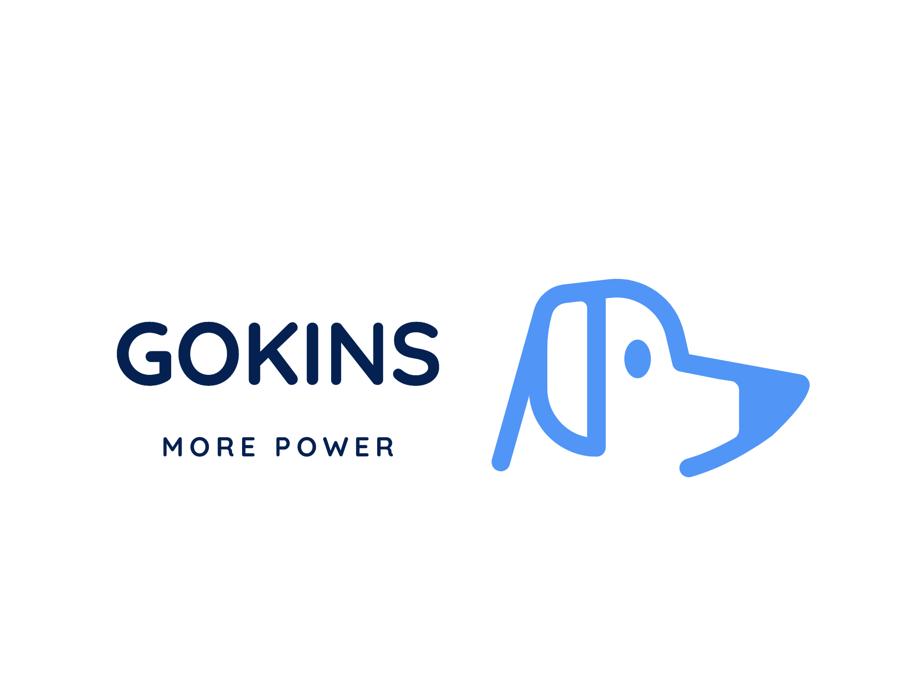

<p align="center"></p>

# Goinks: *More Power*   
构建赋能，更加强大

  [](https://www.apache.org/licenses/LICENSE-2.0.html)

-------

## What does it do

Gokins是一个由Go语言和Vue编写的款轻量级、能够持续集成和持续交付的工具


* **持续集成和持续交付** 
    
   作为一个可扩展的自动化服务器，Gokins 可以用作简单的 CI 服务器，或者变成任何项目的持续交付中心
    
* **简易安装**
  
   Gokins 是一个基于 Go 的独立程序，可以立即运行，包含 Windows、Mac OS X 和其他类 Unix 操作系统。
    
* **配置简单**
    
    Gokins 可以通过其网页界面轻松设置和配置，几乎没有难度。
    
* **安全**
    
    绝不收集任何用户、服务器信息，是一个独立安全的服务
   
## Gokins 官网

**地址 : http://gokins.cn** 


## Demo

**体验地址：http://demo.gokins.cn:8030**


 1. 本示例仅提供展示作用(登录密码：123456)
 2. 此示例每天凌晨会有gokins定时器 __重新编译__
 3. 如果进不去，就是被其他人玩坏了，请等待重新编译（第二天早点来）
 4. 示例提供`git`、`gcc`、`golang`、`java8`、`maven`环境
 

 

## Quick Start

It is super easy to get started with your first project.


#### Step 1: 下载

[latest stable release](https://github.com/mgr9525/gokins/releases).  

#### Step 2: 启动服务

```
./gokins
``` 
#### Step 3: 查看服务

访问 `http://localhost:8030`


### 使用gokins


#### 下载运行

- github地址 ： https://github.com/mgr9525/gokins
- gitee地址 ： https://gitee.com/mgr9525/gokins

可在对应平台需找发行版

- 或者直接在服务器上执行以下命令

```

//获取可执行文件
wget -c  https://github.com/mgr9525/gokins/releases/download/v0.1.2/gokins-linux-amd64

//授权
chmod +x gokins-linux-amd64

//运行gokins
./gokins-linux-amd64

//查看帮助命令
./gokins-linux-amd64 --help

```

- 运行成功后 访问 `8030` 端口

#### 初始化配置
- 设置root账号密码


- 登录后我们可以查看主界面


#### 流水线的使用
1. 更新git代码

配置代码目录

```

cd ~
mkdir programs
cd programs
git clone http://用户名:密码@git.xxx.cn/IPFS/IPFS-Slave.git
cd IPFS-Slave/
pwd

```

使用用户名密码clone防止流水线更新代码时需要登录凭证

复制此目录路径，新建流水线时需要

2. 流水线构建


3. 新建好之后进入插件列表新建插件


4.  首先新建一个更新git的插件


5. 之后新建一个编译插件


可以查看到有两个插件


6. 返回运行流水线


- 以上就完成了一个简单的CI流水线工程


## 开发Gokins
Gokins目前还处于需要不断进步的阶段，如果你有兴趣假如我们，可以在github上提交pr或者iss


### 服务器环境
     服务器： ubuntu18 linux64位
     项目需要环境：git、golang、node.js
      
### 安装项目环境

1. git
`要求 git 2.17.1 或者 2.x 其他版本`

2. node.js
 `要求 node 12.19.0 `
 
4. golang
 `要求 golang 1.15.2 `


## Gokins的优势和未来趋势
- 体积小，无论是可执行文件还是运行内存，相对于Jenkins的运行内存节约不止一个量级，目前Gokins的运行内存大概就是在20kb左右
- 简单友好的UI交互，更加利于上手
- 自定义的插件配置，让你可以应对多种情况
- 安全，绝不收集任何用户或者服务器信息

在未来，一个简单、易用的CI/CD工具会大大提高企业的生产效率。同时Gokins不仅仅可以作为代码交付方面的工具，同样可以成为自动化运维的核心组件，用于支持大型工程。


## 更多

### 帮助

```
./gokins -h
``` 

### 升级

升级数据库、添加触发器功能，针对于于之前使用过Gokins的用户

```
./gokins -up
``` 

## Contact

* Join us from QQ(Group : 975316343). 

<p align="center"></p>

## Download

- [Github Release](https://github.com/mgr9525/gokins/releases)


## Who is using
<a href="http://1ydts.com" align="center"></a>

## 开发日志


 ### Gokins V0.2.0 (更新日期2020-10-24)
 - 新增功能 ：
  1. 新增gitlab、gitee的webhook触发流水线的方式
  2. 新增流水行执行完毕后的后续再执行工作功能
 
 - bug fix ：
  1. 修复一些已知问题
  
***

### Gokins V0.1.2 (更新日期2020-10-20)
- 新增功能 ：
 1. 新增触发器（加入流水线日志触发方式）
 2. 实现触发器manager，task
 3. 新增升级功能 `./gokins -up`（升级数据库、添加触发器功能，针对于于之前使用过Gokins的用户）

- bug fix ：
 1. 前端循环请求卡死问题
 2. 协程context严重bug整改

- 优化问题 ：
 1. 日志入库改为日志文件,减少数据库大小
 2. 环境变量PATH优化,加入变量获取
 


 

